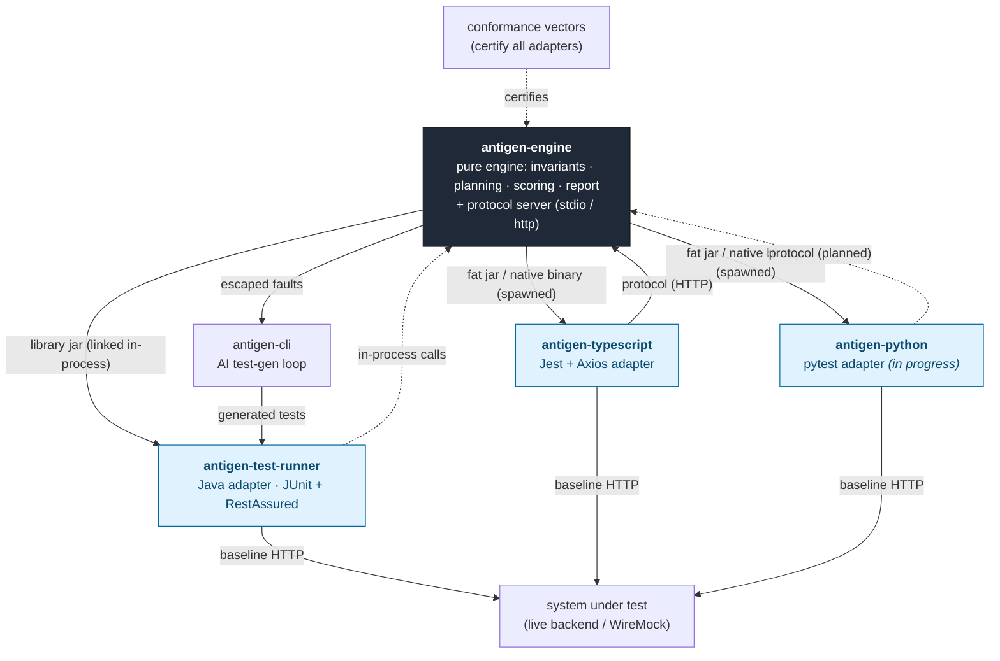
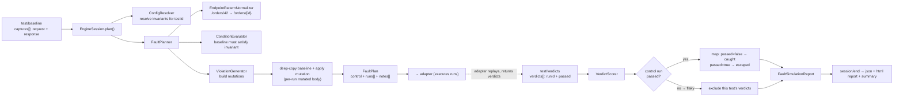

# Antigen — architecture diagram

Visual companion to [`docs/knowledge/architecture.md`](knowledge/architecture.md). Antigen runs
fault simulation against an API test suite: it mutates HTTP responses to violate declared
**invariants** and reports whether tests catch the faults (**caught**) or miss them (**escaped**).

The system is **one engine, many adapters**: a pure, language-neutral engine owns all mutation and
scoring; per-language adapters are thin glue that capture baseline traffic, replay the engine's
plan, and report verdicts. The Java adapter links the engine **in-process**; foreign adapters
(TypeScript, Python) spawn it as a process and talk the **protocol** over stdio/HTTP.

---

## 1. System topology



> One engine owns all the math; adapters are thin glue. The **Java adapter links the engine
> in-process**; **TypeScript/Python spawn it** and talk the protocol. See §2–§3 for the internals.

**Key relationships**

- **One engine, many adapters.** `antigen-engine` holds all the math (config, invariants,
  planning, scoring, report). Adapters never construct or score mutations.
- **Java links; foreign spawns.** `antigen-test-runner` depends on the engine jar and calls
  `EngineSession` **in-process** — no process, no protocol. TypeScript/Python spawn the fat jar (or,
  later, the native binary) and drive it over the **protocol**.
- **Dependency direction is enforced**: adapters depend on the engine, never the reverse
  (`EngineLayerTest` purity guard).
- **Conformance vectors** certify that every adapter produces the same plan/report from the same
  inputs — that's what makes detection rates comparable across languages.

---

## 2. Engine internal pipeline (one test)

How a single `test/baseline` → `test/verdicts` round-trip flows through the pure engine.



Notes:
- Cross-field / temporal invariants (`created_at <= updated_at`) are typically **uncatchable** by
  assertion libraries — expected escapes, not bugs.
- The mutated body is a **deep copy** of the baseline (a shallow copy leaks nested-field mutations
  across runs — see `docs/knowledge/gotchas.md`).

---

## 3. Runtime protocol sequence (foreign adapter)

What `npm run test:antigen` (or the future pytest equivalent) actually does. The Java adapter
collapses this to direct in-process method calls — same operations, no wire.

```mermaid
sequenceDiagram
    autonumber
    participant H as Test harness<br/>(Jest globalSetup)
    participant A as Adapter<br/>(FaultSimulator + shims)
    participant E as Engine process<br/>(fat jar, http)
    participant B as Backend<br/>(WireMock / live)

    H->>E: spawn `java -jar …-all.jar http`
    E-->>H: ANTIGEN_PORT=<n>
    H->>E: session/start {protocolVersion, configDir, adapter}
    E-->>H: {sessionId}

    loop per test
        A->>B: baseline run (real HTTP)
        B-->>A: captured request/response
        A->>E: test/baseline {sessionId, testId, captures[]}
        E-->>A: FaultPlan {control, runs[], notes[]}
        loop each planned run
            A->>A: replay test; shim serves engine's mutated body<br/>(no real network on re-run)
            A->>A: record pass/fail verdict
        end
        A->>E: test/verdicts {verdicts[]}
        E-->>A: {ok}
    end

    H->>E: session/end {sessionId}
    E-->>H: {summary: faults/caught/escaped/flaky}
    Note over E: writes build/antigen/fault_simulation_report.json
    H->>E: kill process (globalTeardown)
```

**Verdict semantics** (protocol §4.3): for fault runs `passed:true` = **escaped**, `passed:false`
= **caught**; for the control run `passed:false` = **flaky** (the engine drops that test's
verdicts). The adapter reports raw pass/fail — interpretation is the engine's job.

---

## Repos at a glance

| Repo | Role | Talks to engine via |
|------|------|---------------------|
| `antigen` | engine + Java adapter + CLI + conformance vectors | in-process (Java adapter) |
| `antigen-typescript` | Jest + Axios adapter | protocol (HTTP), spawns fat jar |
| `antigen-python` | pytest adapter (Phase 5, in progress) | protocol (planned) |
